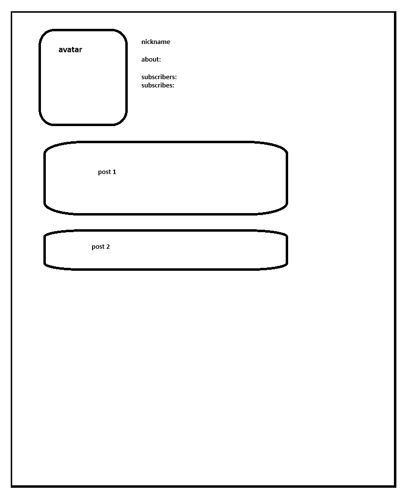

<h3 align="center">Project OK-Social-BackEnd</h3>

## About

Social media project where users can create, edit, delete posts, subscribe and unsubscribe to other users.

## Visual scheme

## Entities description

1. Profile
   1. id
   2. createdAt
   3. updatedAt
   4. avatar
   5. email
   6. official name
   7. first_name
   8. last_name
   9. birthday

2. Post 
   1. id 
   2. createdAt 
   3. updatedAt 
   4. author body 
   5. authorType
   6. attachments

3. 
   1. PostAttachment
   2. postId  
   3. createdAt  
   4. fileId

4. PostFile
   1. id
   2. attachmentId

## Functions
1. CRUDS(create, read, update, delete, search) for profiles
2. CRUD(create, read, update, delete) for posts

# ADR 1: Registration on platform

## Context and problem definition

Users that wants to make their profile and make any posts should be able to register.
Needs to be determined most suitable mechanism for registration.

## Solvable business requirements

- **User Story 1: Registration on platform**

## List of possibilities to solve the problem

1. Register users with email and password.
2. Possibility of registration via social networks to simplify the process.

## Decision

Decision: Registration with email and password.

# ADR 2: Making posts

## Context and problem definition

Users should be able to create, read, update, delete posts.
Needs to be determined most suitable mechanism for managing posts.

## Solvable business requirements

- **User Story 2: Managing posts**

## List of possibilities to solve the problem

1. Create control panel for users to manage their posts, create mechanism to read other users posts.
2. Use third party services

## Decision

Decision: Create control panel for users to manage their posts, create mechanism to read other users posts.

## Components diagram C4

## Контакты.
- skyrockpk@gmail.com
- <a href="https://t.me/julus_skyrock" target="_blank">Телеграм</a></h1>